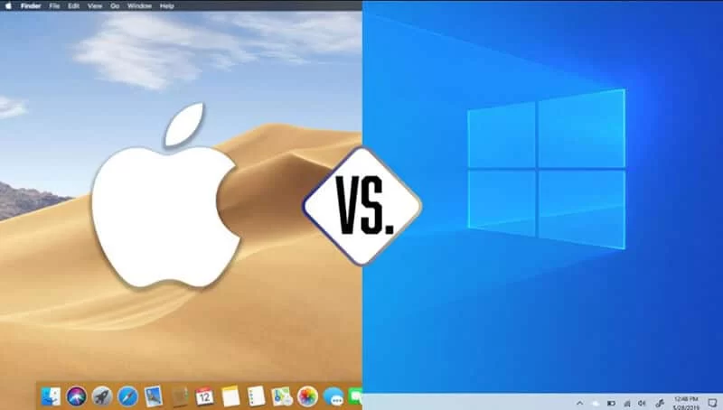

# sidhu_gregory_midterm

This is the argument between mac and windows.

## Hardware Compatibility

**Mac**

_macOS is exclusive to Apple computers, meaning it’s only meant to run on devices like the MacBook, iMac, Mac Mini, and Mac Pro_

**Windows**

_In contrast, Windows runs on a wide range of devices, from powerful workstations to smaller devices like the Raspberry Pi1. As of April 2022, 74% of computers worldwide run on Windows, compared to 15% for macOS1._

## Customization

**Mac**

_Apple manufactures its own hardware and software, which makes it simpler to select which computer you need1._

**Windows**

_Computers running on Windows have a greater degree of customization compared to Apple’s. You’re free to change a PC’s CPU, GPU, memory, and storage far easier than you can with an Apple device1._

## Game Compatibility

**Mac**

_Game compatibility, or lack of it, is the single most critical contributor to the downfall of Mac gaming_

**Windows**

_Currently, there are thousands more games available for Windows than Mac, and none (to this writer’s knowledge) that are available for Mac only and not Windows._